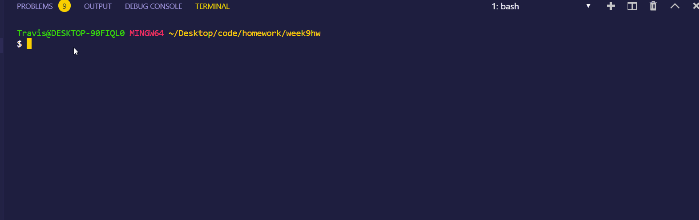
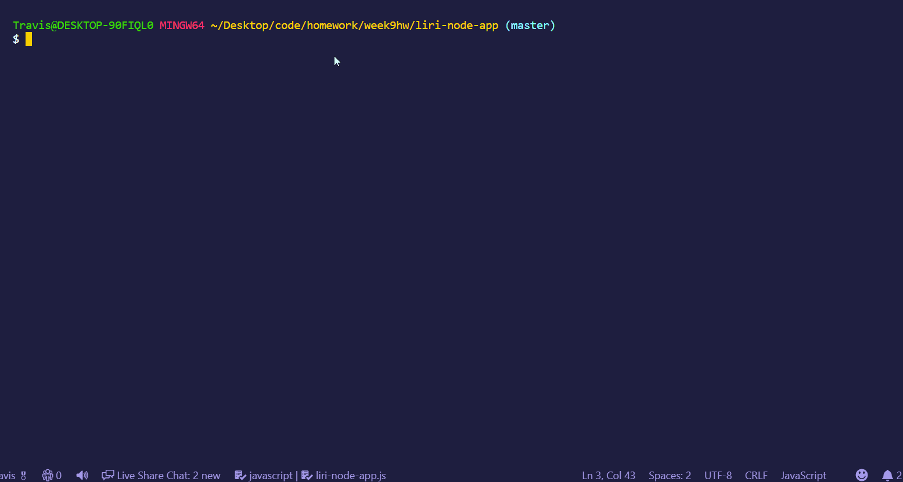
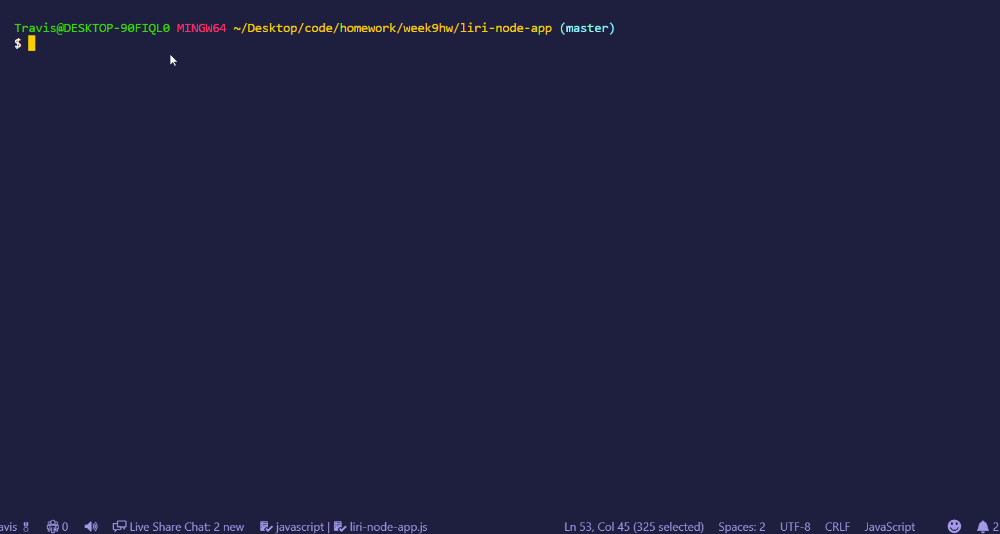

To My Benevolent Grader:
This was all I could get done. I haven't figured out how to have a default movie, song or concert if that is left blank, I haven't used moment to prettify the date for the concert and I haven't done anything with `fs`.  This was hard, really hard. I want to finish it, but Imma need a shitton (actual measurement) of guidance. 

# Liri Node CLI App

## What It Is
Liri is a CLI (Command Line Interface) app which means it lives and is manipulated in bash rather than a browser. It uses node.js to do the work for you right in the terminal!

## What It Does
Unlike Siri, Liri can't "hear" you and it can't talk back to you in a soothing Australian accent, but it can "read" your input from the command line and provide you with information based on your input.

With Liri, you have a variety of search options: movie titles, song titles and up and coming concert locations for bands.

## How to Use It
Using Liri is as simple as 1, 2, 3. 
1) Open your bash terminal and CD into your folder that contains your liri-node-app.js file. 
2) In the command line enter `node liri-node-app.js` and follow it up with a movie title, song or band. 
3) Hit enter and bask in your newly acquired information!

## What Information You'll Access

### Movie Title:
When you enter a movie title you will have access to the following information:

* title
* release year
* rating (G, PG, etc.)
* genre
* the country in which it was produced
* the language of the movie
* actors
* a brief synopsis
* IMDB rating 
* Rotten Tomatoes rating.

If no movie title is entered you'll get back a default of *Mr. Nobody*.

### Song Title:
Entering the name of a song will provide you the following:

* song title
* artist(s)
* the album on which it appears 
* whether or not the lyrics are explicit
* a preview link of the song.

If no song title is entered you'll get back a default of *God Save the Queen*.

### Band
By entering in a band name you have access to the following concert information:

* venue
* venue location: city, country
* date of the event

If no band name is entered you'll get back a default of Chain Smokers.

## The Works
Liri gets its information from a series of API calls: Spotify for music, OMDb for movies and Bandintown for concert information.

The app depends on several different files to do its job. When a user inputs a search parameter into the command line, the `liri-node-app.js`file will look at the search parameter and then send API requests by the axios package to the respective sites. 

But in order to do that, we need to have access to our API keys which are stored two layers down in their own separate and "hidden" `.env`file. 

The API keys have one layer between them and the JavaScrip file called `keys.js`which acts as a liaison between `liri-node-app.js` and `.env`. 

The information is passed between all three of the files via the `require` method. 

Once the search parameters and API keys are all matched, the call to the respective API is made and the information displayed in the command line. Yea, no CSS!

## Watch It In Action
### Bandsintown

### Spotify 

### OMBd

